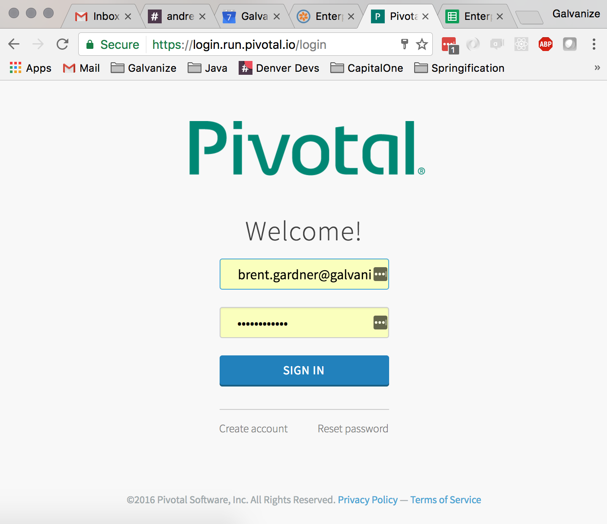
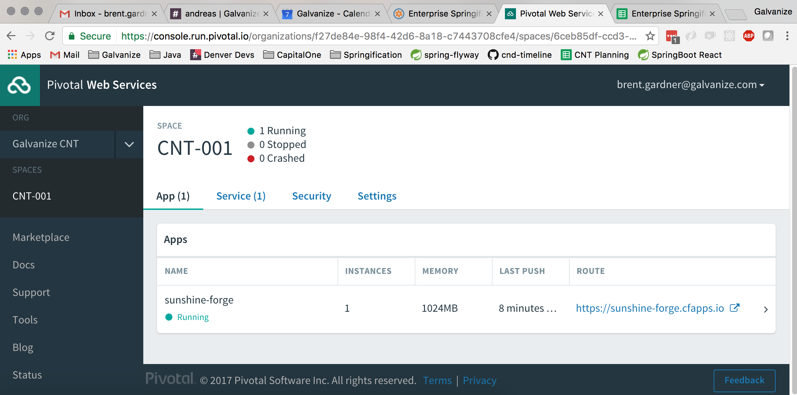
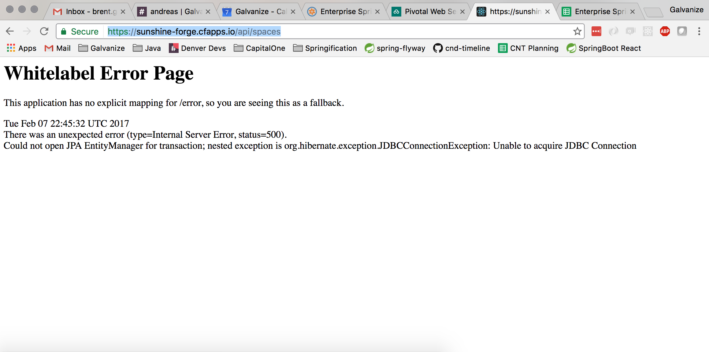
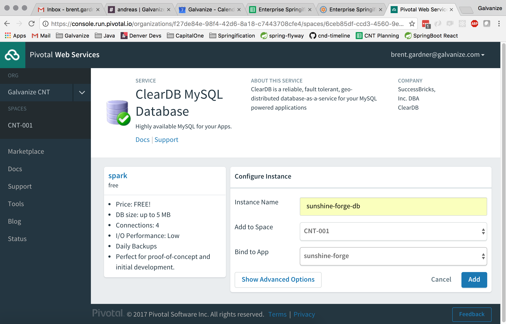
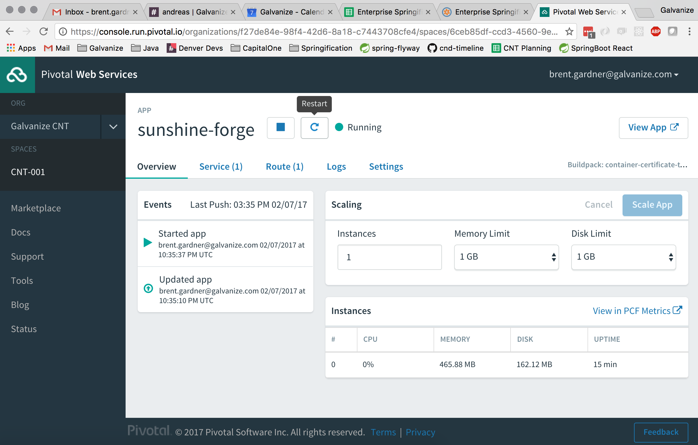
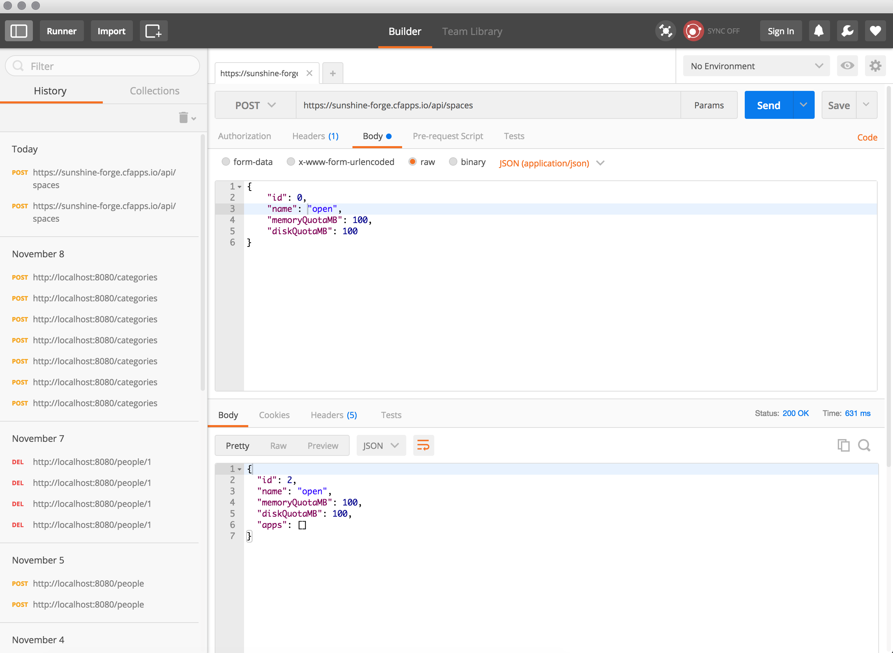
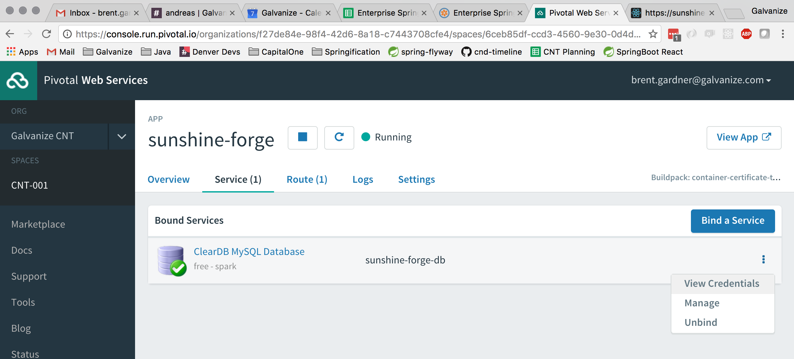
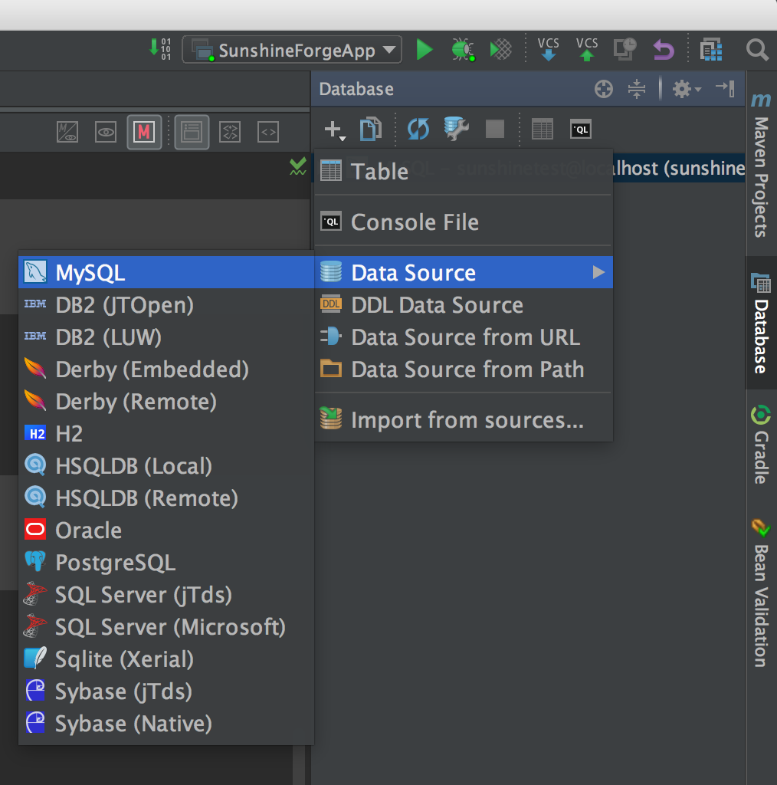
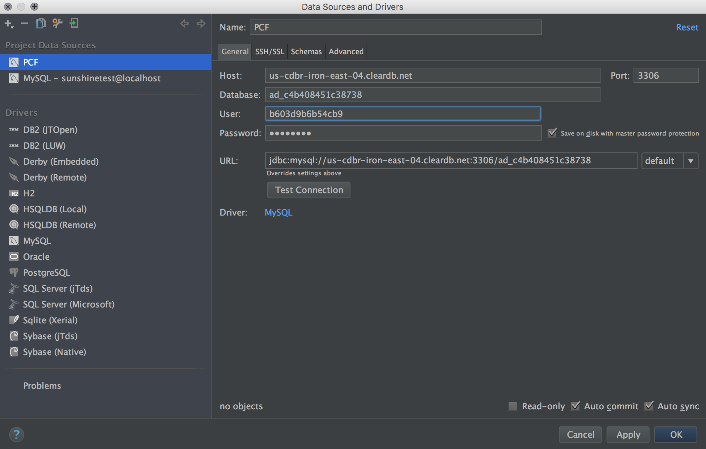
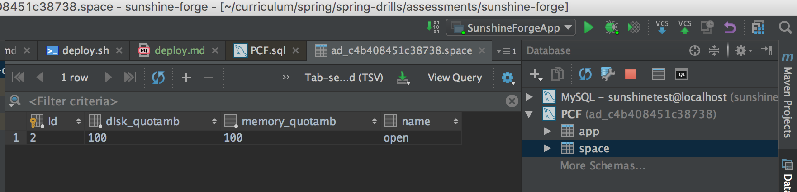

# Sunshine Forge

## Deployment

Congratulations on creating your very own API in Sprint Boot! Now it is time to deploy it to PCF.

### Step 1: Package

Now that the API is tested and functions as expected locally, it's time to pack it into a [fat jar]() for deployment to PCF. Fortunately, Spring Boot comes with a [built-in task](http://docs.spring.io/spring-boot/docs/current/reference/html/build-tool-plugins-gradle-plugin.html#build-tool-plugins-gradle-repackage-configuration) to accomplish this. Just open your terminal and run the command:

```bash
gradle bootRepackage
```

If the command succeeded, you should be able to see two jars if you `ls` the `build/libs/` directory:

```bash
bgmac:sunshine-forge brent.gardner$ ls -lh ./build/libs/
total 75472
-rw-r--r--  1 brent.gardner  staff    36M Feb  7 15:21 sunshine-forge-0.0.1-SNAPSHOT.jar
-rw-r--r--  1 brent.gardner  staff   889K Feb  7 15:21 sunshine-forge-0.0.1-SNAPSHOT.jar.original
bgmac:sunshine-forge brent.gardner$ 
```

The `.jar.original` file contains only the classes that you wrote. The `.jar` file contains all your code, plus all of your dependencies, and all of their dependencies. Typically in Java these can be quite large.

### Step 2: Install PCF CLI

Next you'll want to install the PCF CLI. Go to their [download page](https://github.com/cloudfoundry/cli#downloads) and follow the instructions for your platform.

### Step 3: Login

Once you have the console installed, you'll need to login:

```    
bgmac:sunshine-forge brent.gardner$ cf login
API endpoint: https://api.run.pivotal.io

Email> brent.gardner@galvanize.com

Password> 
Authenticating...
OK

Select an org (or press enter to skip):
1. brent.gardner-org
2. Galvanize CNT

Org> 2                   
Targeted org Galvanize CNT

Targeted space CNT-001


                
API endpoint:   https://api.run.pivotal.io (API version: 2.69.0)
User:           brent.gardner@galvanize.com
Org:            Galvanize CNT
Space:          CNT-001
bgmac:sunshine-forge brent.gardner$ 
```

### Step 4: Push your app!
 
Once we've logged in, it's time to push the app:

```
cf push sunshine-forge -p ./build/libs/sunshine-forge-0.0.1-SNAPSHOT.jar
```

This process will take a little while, but if it succeeds, you should see a message like the following:

```
requested state: started
instances: 1/1
usage: 1G x 1 instances
urls: sunshine-forge.cfapps.io
last uploaded: Tue Feb 7 22:35:18 UTC 2017
stack: cflinuxfs2
buildpack: container-certificate-trust-store=1.0.0_RELEASE java-buildpack=v3.12-offline-https://github.com/cloudfoundry/java-buildpack.git#6f25b7e java-main open-jdk-like-jre=1.8.0_121 open-jdk-like-memory-calculator=2.0.2_RELEASE spring-auto-reconfiguration=1.10...

     state     since                    cpu      memory         disk           details
#0   running   2017-02-07 03:36:27 PM   195.8%   444.6M of 1G   162.1M of 1G
bgmac:sunshine-forge brent.gardner$ 
```

### Step 5: Check your app in Pivotal Console 

Next, log into [Pivotal Console](https://login.run.pivotal.io/login):



And select your space:


You should now see your app, with a real working URL!
 


If you append `/api/spaces` to your URL, you should see a JDBC error:



This is because we haven't set up our database yet! Let's add a new database by going to the market place and searching for MySQL:


Select ClearDB:


Give it a name and bind it to your App:



Restart your app to make sure it's settings are updated:



Now you should be able to navigate to your API url:

```
bgmac:sunshine-forge brent.gardner$ curl https://sunshine-forge.cfapps.io/api/spaces
[]
bgmac:sunshine-forge brent.gardner$ 
```

And you can try a post in PostMan:



And if it succeeds, you should see your data!

```
bgmac:sunshine-forge brent.gardner$ curl https://sunshine-forge.cfapps.io/api/spaces
[{"id":2,"name":"open","memoryQuotaMB":100,"diskQuotaMB":100,"apps":[]}]
bgmac:sunshine-forge brent.gardner$ 
```

Finally, to be very sure, let's view our database credentials:



And copy them onto the clipboard:


Next open the database tab in IntelliJ:



And put in your credentials:



Finally, click "edit table" and verify your object is in the database:

