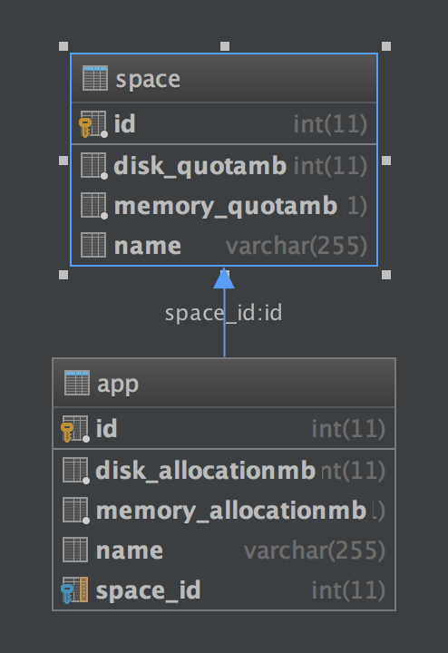

# Sunshine Forge

## Background

You have been hired as a developer at Sunshine Forge - a young startup that intends to compete with Cloud Foundry.

In your new role, you are expected to work with your pair and develop an API using Spring Boot and MySQL.

Sunshine Forge will work much like Cloud Foundry: the main entity in the data model is an App. Developers will write apps and push them to Sunshine Forge for hosting. Since one company might have many Apps, each app will be contained in a Space:                     

Customers will be billed for spaces based upon the amount of resources they are allocated:

1. Hard drive space
1. Memory

Each app will declare the amount of disk and memory that it will consume. If clients exceed the quotas they've purchased, they should not be allowed to push apps until they buy more. For this assignment you can ignore the actual billing requirements, only the quotas will need to be enforced.

Since you are building an API, your primary users will be the front-end team which will consume your API. Several stories have come out of the inception.

*** As usual write tests first, and be sure to switch drivers! ***

### Epic #1: Spaces

1. As a cloud native developer, I want to create a Space where I can deploy my Application
1. As a cloud native developer, I want to see all of the Spaces so that I can find a specific ID or see the total number of Spaces
1. As a cloud native developer, I want to see the details of a Space so that I can estimate future disk capacity needs
1. As a cloud native developer, I want to edit to a Space so that I can keep it up to date and rename it as needed
1. As a cloud native developer, I want to be able to remove a Space so it cannot be used

### Epic #2: Apps

1. As a cloud native developer, I want to create an App within a space so that I can deploy it
1. As a cloud native developer, I want see all Apps within a Space to find a specific ID or see the usage within the Space
1. As a cloud native developer, I want to see the details of a single App so I can evaluate its memory and disk usage
1. As a cloud native developer, I want to edit an App so that I can keep its details up to date
1. As a cloud native developer, I want to be able to remove an App from a Space in order to free up memory and disk in that Space
1. As a cloud native developer, I should not be able to create an App in a Space if there is not enough disk space or memory available

### Epic #3: Stretch
1. As a cloud native developer, I would like to prevent users from accessing each others Spaces and Apps. Hint: [Basic Authentication](http://websystique.com/spring-security/secure-spring-rest-api-using-basic-authentication/)

## Reflection

Stop coding approximately 15 minutes before the end of the exercise and have a discussion with your pair.

Some questions to answer as a pair:

1. How do Spring Boot make the job easier?
1. In what ways did you struggle with Spring?
1. What errors did you encounter?
1. What were the most effective techniques you used to debug those errors?
1. How did you perform as a pair? Which pairing techniques worked best?
1. Is there anything you would have done differently if you had to do this activity again?
